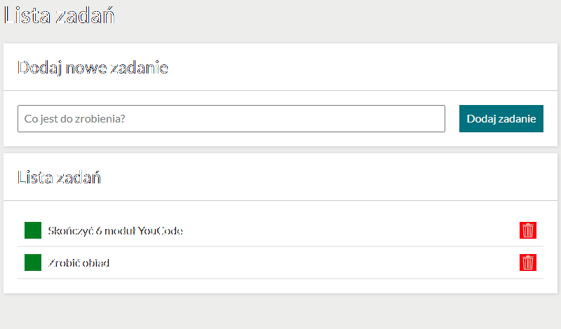
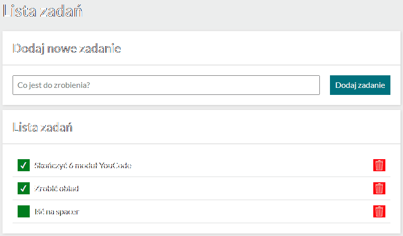

# Rafał Solnica - To do list

## Description

Welcome to my simple to do list. This project has been made as a homework at the YouCode front-end developer course.

## Demo

https://rafalsolnica.github.io/to-do-list/

## How it works

It's really simple. In the text input enter task that needs to be done and then click 'Dodaj zadanie' button or Enter on your keyboard. New task will be added to the list.

Once it's done click the green checkmark button to mark it as completed or click
red trash bin to remove it entirely.

### Technologies used in this project:

-   HTML, BEM convention
-   CSS, normalize.css, flexbox
-   JavaScript ES6+ features
